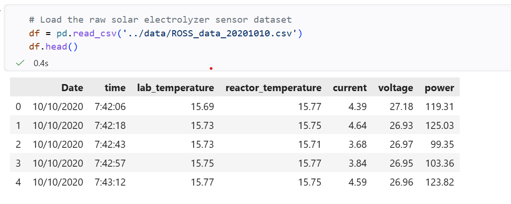

## Green Hydrogen Production Forecasting using Machine Learning 🚀
This repository contains a complete machine learning project that predicts hydrogen gas production from a solar-powered electrolyzer. 
Using real-world sensor data (like temperature, current, and voltage), this project shows how to transition from a simple baseline model to tree-based models, achieving a peak prediction accuracy of 96.60%.


## 📊 Project Overview
This project explores three machine learning approaches: Linear Regression, Random Forest, and XGBoost, to find the best way to handle the complex physical and temporal patterns. The results demonstrate that while the core process is highly linear, ensemble tree methods excel at smoothing out noise and capturing minor non-linear curves.

## 📂 Dataset Source  
The data used in this project consists of real-world sensor logs capturing a continuous solar-to-hydrogen electrolysis run on 10/10/2020.  
Source: [Kaggle](https://www.kaggle.com/code/faradayeffect/h2-electrolyzer-voltage-vs-current/notebook)  
Data Dimensions: 2,972 entries tracking laboratory conditions, reactor metrics, and electrical inputs.  
Features Included: lab_temperature, reactor_temperature, current, voltage, power, and timestamps.



## 🛠️ The Tech Stack
* Language: Python
* Core Libraries: scikit-learn, xgboost, random forest, linear regression, pandas, numpy
* Visualization: matplotlib, seaborn 


## 📈 Model Performance & Progression
Three distinct model architectures were tested to see how well they could map the underlying chemical and electrical patterns of the dataset.

| Machine Learning Model | R² Score (Accuracy) | Mean Absolute Error (MAE) | Engineering Takeaway |
|------------------------|---------------------|---------------------------|----------------------|
| Linear Regression | **92.56%** | 4.47 × 10⁻⁵ grams | Confirms that the core electrical relationship (Faraday's Law) is incredibly strong, but misses minor non-linear curves. |
| Random Forest (Winner) | **96.60%** | 2.71 × 10⁻⁵ grams | Achieves peak performance. The ensemble averaging approach smooths out sensor noise and solar spikes without overfitting. |
| XGBoost | **93.13%** | 4.57 × 10⁻⁵ grams | Delivers strong accuracy, but its aggressive boosting structure slightly overfits minor noise patterns compared to Random Forest. |


------------------------------
## 🧠 Key Data Engineering Insights
   1. The Data Splitting: Because this dataset tracks a process over time, keeping the training data and testing data properly isolated was critical.  
   2. Feature Duplication: Correlation analysis showed that current and power had a near-perfect correlation of 0.9996. This aligns with electrical physics (Power = Current × Voltage). Tree models like Random Forest and XGBoost successfully handled this collinearity without losing predictive stability.
  
------------------------------
## 📁 Repository Structure

├── data/  
│   └── electrolyzer_sensor_data.csv        # Raw sensor log file  
├── notebooks/  
│   └── hydrogen_prediction_pipeline.ipynb  # Clean, end-to-end Python notebook  
├── outputs/  
│   ├── electrolyzer_cleaning_comparison.png   
│   ├── linear_regression_predictions.png   
│   ├── random_forest_regression_predictions.png   
│   ├── xgb_regressiion_predictions.png   
│   └── random_forest_predictions_over_time  
├── raw_electrolyzer_data_from_Faraday_One.png      # Screenshot of the raw data  
└── README.md                            # Project documentation (this file)  

------------------------------
## 🚀 How to Run This Project

   1. Clone the repository:  
   ```bash  
   git clone https://github.com/MwithHeart/hydrogen-yield-prediction.git
   ```
   ```bash  
   cd hydrogen-yield-prediction
   ```
   
   2. Install requirements:  
   ```bash  
   pip install scikit-learn xgboost pandas numpy matplotlib seaborn  
   ```  
   
   3. Run the notebook: Open `notebooks/hydrogen_prediction_pipeline.ipynb` in Jupyter Notebook or VS Code and run all cells.


